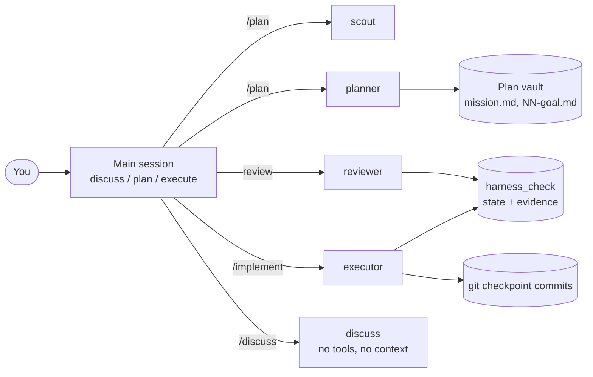

# pi-harness

A personal agent harness for the [Pi](https://www.npmjs.com/package/@earendil-works/pi-coding-agent) coding agent, tuned for distributed systems, cryptography and low-latency backend work.

It turns Pi into a small team of single-purpose agents run by one orchestrator (your main session). Behaviour is enforced by code where possible: subagents get only the tools they need, bash runs inside the macOS sandbox, credentials are blocked at the tool level, and an executor can't report a task done unless the checks it registered up front have passed on the current files.

> This is the `~/.pi` directory of one machine, published as-is. Paths such as the Obsidian vault under ProtonDrive are personal; change them before reusing anything (see [Configuration](#configuration)).

## What you get

| Feature | What it does |
|---|---|
| Modes | The main session is always in `discuss`, `plan` or `execute`. Each mode changes which tools exist and blocks the rest. Press Tab to cycle; the footer shows the current mode. |
| Subagents | `scout`, `planner`, `executor`, `reviewer` and `discuss`, each a fresh Pi process with its own context window, toolset and model. |
| Mission/goal planner | `/plan` interviews you about one feature at a time, splits it into small verifiable tasks, and lets you place checkpoints, each with manual, automatic or combined review. |
| Verification gates | `harness_check` records which checks must pass, runs them, and fingerprints the files they ran against. Changing a file afterwards invalidates the result. |
| Checkpoint commits | The executor commits only the files it names, and only after every check passes. |
| Sandbox and credentials guard | Bash runs under macOS Seatbelt. A separate guard blocks file tools from reading `.env`, SSH keys, `auth.json` and personal notes. |
| Live progress | Subagent panels stream thinking, text, tool calls, elapsed time and tokens per second. |
| `question` tool | Every interview question appears as a keyboard list: radio buttons for one answer, checkboxes (`multiSelect`) when several apply. The recommended answer comes first, and the last row is always "type your own answer". Available in all modes. |
| Advisor | `pi-advisor-flow` pairs the main model with a stronger reviewer that steps in after repeated failures. |
| Code intelligence and debugging | The executor has Lens (diagnostics, symbols, LSP, AST search/replace) and a batch LLDB `debug` tool. |

## How it fits together



- The main session is the only orchestrator. Subagents can't spawn other agents, so every fan-out is visible to you and can be aborted.
- Every subagent is amnesiac. Each one is a `pi --mode json -p --no-session` process. Context reaches it only through its task text, `{previous}` in a chain, or the files it reads.
- One writer per checkout. A cross-process lock stops two mutating subagents from editing the same repository at once. Read-only scouts and reviewers can run in parallel.

## Status

- Covered by tests: modes, sandbox policy, credential guard, verification evidence, checkpoint commits, writer lock, subagent streaming and budgets, the `question` tool.
- Measured once: on four small domain bugs with tests hidden, the harness and a plain agent on the same model both solved 8/8. The harness took about 1.5× the time and cost, and the only thing it added was recorded evidence. Harder cases are needed to tell them apart (`agent/tests/domain-eval.mjs`).
- Not yet run end to end: `/implement <goal file>`, including parallel worktrees and checkpoint reviews.

## Install

Requirements:

- macOS (the bash sandbox uses Seatbelt; Linux is partly supported)
- Node.js 22.19 or newer
- Git, plus `lldb` if you want the debugger
- Optional: TypeScript (`npm i -g typescript`) for the strict typecheck

Steps:

```sh
# 1. Put the repo where Pi expects its config
git clone --recurse-submodules git@github.com:rac-sri/pi-harness.git ~/.pi
cd ~/.pi/agent

# 2. Install Pi itself so agent/install/current-version and
#    agent/install/releases/<version>/ exist (not tracked in git).

# 3. Install extension dependencies (also applies the advisor patch)
(cd npm && npm install)
(cd extensions/sandbox && npm install)

# 4. Use the managed launcher, which picks the model from agents/models.json
ln -s ~/.pi/agent/bin/pi /usr/local/bin/pi   # or add agent/bin to PATH

# 5. Log in to your model providers
pi auth
```

Then edit the [configuration](#configuration) files, at least the models and the plan directory, and run the [tests](#tests).

## Daily use

### Modes

| Mode | Can do | Use it for |
|---|---|---|
| `discuss` (default) | Read files only; no bash, no edits. Can dispatch only the `discuss` agent. | Thinking about a design before touching anything |
| `plan` | Read files, read-only bash, scout/planner/reviewer. Executor blocked. | Investigating and writing plans |
| `execute` | Everything | Making changes |

Switch with `/mode discuss|plan|execute`, Tab, or Ctrl+Alt+M. Autocomplete moves to Ctrl+Space. Each mode's instructions are a fixed system-prompt section, so the provider's prompt cache survives across turns.

### Slash commands

| Command | Flow | Changes code? |
|---|---|---|
| `/discuss <topic>` | One `discuss` agent with no tools or project context. Paste in anything it should know. | No |
| `/plan <mission>` | Plans one goal: interview, planner draft, your checkpoints, planner finalize. See [below](#micro-managed-planning-missions-and-goals). | No |
| `/implement <request>` | Path A: one executor for a small, clear task. Path B: scout, planner, executor, reviewer for multi-component or sensitive changes. | Yes |
| `/implement <goal file>` | Path G: runs a goal file checkpoint by checkpoint, stopping for review where you asked. | Yes |
| `/build-and-review <request>` | Scout, executor, adversarial reviewer, then an executor fix run only if the reviewer found problems. | Yes |

Any command stops and reports `PROVIDER UNAVAILABLE` on quota or auth errors (429/402/401/403) instead of retrying.

## Micro-managed planning: missions and goals

The planner is built to keep a human in the loop and keep code churn low. It never plans more than one feature at a time.

#### Terms

- Mission: the whole product or initiative, e.g. `payments-v1`.
- Goal: one feature or module of the mission. Goals are planned and built in order, one at a time.
- Task: one small step inside a goal, about 1-3 files and one behaviour, with its own verify command.
- Checkpoint: a line you draw between tasks. Each has a review mode:
  - `manual`: you review
  - `auto`: the reviewer agent reviews
  - `both`: the reviewer first, then you

#### Files

All plans live outside your repository, under the configured plan root:

```text
<plan root>/<project>/
└── payments-v1/                # mission
    ├── mission.md              # ordered goal list + status of each
    ├── 01-ledger.md            # goal file (planned, being built, or done)
    └── 02-settlement.md        # written only when goal 02 is planned
```

Goal status in `mission.md` moves `pending → planning → planned → executing → done`.

You don't have to type `/plan`. Asking for an implementation plan in plan or execute mode ("make the plan", "write the steps") starts the same flow.

#### `/plan payments-v1`, step by step

1. Mission. For a new mission, agree the ordered list of goals (one line each). For an existing one, pick the next `pending` goal.
2. Context. A scout reads the code relevant to this goal and the `## Deferred` notes left by earlier goals.
3. Grill. The main session interviews you using the `grill-me` skill. One question at a time, shown by the `question` tool as radio buttons, or checkboxes when several answers apply (↑↓ move, Space toggle, 1-9 shortcut, Enter submit). The recommended answer comes first and the last row is "type your own answer", and a running decision ledger stops it from asking a settled question twice, until every decision is settled. It answers from the code itself where it can and pushes back on anything this goal doesn't need.
4. Draft. The planner writes the goal file with numbered tasks, each with files, change, verify command, dependencies and an optional parallel group.
5. Checkpoints. You give the lines (`after T4, after T10`) and a review mode for each. You can edit tasks here too.
6. Finalize. The planner fills in the checkpoints and checklist, and marks the goal `planned`.

#### Running it: `/implement <goal file>`

For each checkpoint segment:

1. Run its tasks. Tasks that share a parallel group run as parallel executors in separate git worktrees and are cherry-picked back in task order.
2. Run the checkpoint's regression checks on the merged result and record a checkpoint commit.
3. Review using the checkpoint's mode. `manual` stops and waits for you. The next segment starts only after the review passes.

When the last checkpoint passes, the goal is marked `done` and the next `/plan payments-v1` moves on.

#### Ground rules the planner follows

- Smallest change that moves the goal forward. No speculative abstractions, config knobs or refactors.
- A goal doesn't have to be fully compatible with later goals. Known gaps go under `## Deferred` and get revisited when they matter.
- Every interview decision is written into the file. Anything left open goes under `## Open questions` with a recommended default, never decided silently.

## Agents

Defined in `agent/agents/*.md`. The frontmatter is the capability policy.

| Agent | Tools | Purpose |
|---|---|---|
| `scout` | read, grep, find, ls, read-only bash | Finds relevant code and returns compressed context |
| `planner` | read, grep, find, ls, write | Writes mission and goal files; never touches code |
| `executor` | read, bash, edit, write, grep, find, ls, `harness_check`, `debug`, Lens tools | Implements plans verbatim with recorded verification |
| `reviewer` | read, grep, find, ls, read-only bash, `harness_check` (status) | Adversarial review: races, nonce reuse, hot-path cost, unsupported checkmarks |
| `discuss` | none | Pure reasoning. No project context, runs in a throwaway temp directory |

- Delegation: no agent has the `subagent` tool. To let one delegate, add `subagent` to its `tools:` list, though keeping orchestration in the main session is recommended.
- Project agents: put a `.md` in `<repo>/.pi/agents/` and call the tool with `agentScope: "both"`. Pi asks before running project-local agents, because a repository's prompts can run bash.

The `subagent` tool has three modes: single `{agent, task}`, parallel `{tasks: [...]}` (up to 8, 4 at a time), and chain `{chain: [...]}`, which passes `{previous}` along and stops at the first failure.

## Verification gates

The executor can't get away with just saying the tests passed. Every implementation task goes through `harness_check`:

```text
define       →  implemented  →  verify (per check)  →  complete | checkpoint
contract +      code written     runs the registered     all evidence matches
fixed checks                     command, records        current files; checkpoint
                                 exit, output, hashes    also commits named files
```

- Fixed up front. The contract and the `{id, command, property}` checks can't change once defined. A changed check means a new run.
- Bound to the files. Evidence records HEAD, tree, a fingerprint of the source files and an output hash. Any later edit, write, bash call, debug session or LSP operation invalidates completion, so the checks must be rerun.
- Enforced by the dispatcher. An executor that finishes without a successful `complete` or `checkpoint` after its last change is reported as rejected.
- Scoped commits. `checkpoint` commits only the files it names. It refuses if anything is already staged or other files have changed, and it never resets or discards work.
- Stored out of reach. Run state lives in `~/.pi/agent/harness/runs/<repo-hash>/<run>/`, which agents can't write to directly.

Plan checkboxes are a summary. The `harness_check` state is the record of truth.

## Safety layers

1. Capability scoping. Each subagent gets an explicit `--tools` allowlist. An empty or invalid list means zero tools, never all tools.
2. OS sandbox for bash. macOS Seatbelt via `@anthropic-ai/sandbox-runtime`, configured in `agent/extensions/sandbox.json`. Credential paths and the vault are denied. If the sandbox fails to start, bash is blocked rather than run unsandboxed.
3. Credentials guard. `agent/extensions/creds-guard.ts` blocks read, write, edit, grep, find, ls and bash on `.env*` (except examples), `~/.ssh`, `auth.json`, keys, and the vault outside `Agents/`. It resolves `..` and symlinks before matching.
4. Mode gates. Unknown plugin tools are blocked in discuss and plan modes. LSP rename, code actions and AST replace are blocked outside execute.
5. Read-only children. Scout and reviewer bash calls go through the same read-only command policy as plan mode.

Escape hatches you have to choose explicitly: `pi --no-sandbox`, and `pi --debug-unsandboxed`, which lets only `debug` calls run outside Seatbelt so LLDB can control processes.

## Configuration

All files live in `agent/` and are re-read on every launch or dispatch unless noted.

| File | Controls |
|---|---|
| `agents/models.json` | The source of truth for models. `default` plus one entry per role, `provider/model[:thinking]`. `null` means use `default`. Keys starting with `_` are comments. |
| `agents/runtime.json` | Per-role thinking level, deadline (seconds), max turns, max output tokens, UI update interval |
| `agents/planner.json` | Plan root, e.g. `{"directory": "~/plans/{project}"}`. `{project}` expands to the repo name. |
| `advisor.json` | `pi-advisor-flow`: executor and advisor models (they must differ) and which gates are on |
| `settings.json` | Pi packages, skill include/exclude globs, Pi's fallback default provider/model |
| `extensions/sandbox.json` | Sandbox filesystem and network allow/deny lists |
| `keybindings.json` | Moves autocomplete to Ctrl+Space so Tab can cycle modes |
| `models.json` | Custom providers, e.g. a local LM Studio endpoint |

Example `agents/models.json`:

```json
{
  "default": "openai/gpt-6.1-sol",
  "scout": "openai/gpt-6-luna",
  "planner": null,
  "executor": null,
  "reviewer": null,
  "discuss": "lmstudio/qwen3.8-27b-splash"
}
```

Restart Pi or run `/reload` after changing extensions or `settings.json`.

## Repository layout

```text
.
├── README.md                 # this file
└── agent/
    ├── HARNESS.md            # detailed reference: every rule and the reason for it
    ├── agents/               # agent definitions + models/runtime/planner config
    ├── prompts/              # slash commands: plan, implement, build-and-review, discuss
    ├── extensions/
    │   ├── subagent/         # subagent tool: dispatch, streaming, budgets, plan storage
    │   ├── sandbox/          # Seatbelt bash, harness_check, debug
    │   ├── modes/            # discuss / plan / execute switch + footer speed
    │   ├── creds-guard.ts    # tool-level credentials and vault guard
    │   ├── compact-read.ts   # compact display for read results
    │   ├── question.ts       # radio/checkbox questions with a type-your-own row
    │   ├── advisor-patch-guard.ts
    │   └── lib/              # verification, writer lock, read-only policy, debugger, token speed
    ├── patches/              # local fix for pi-advisor-flow's missing session id
    ├── npm/                  # Pi packages: pi-advisor-flow, pi-lens, pi-web-access
    ├── skills/ethskills/     # git submodule (excluded from prompts by default)
    ├── tests/                # regression checks, see below
    └── bin/pi                # managed launcher (Node version + default model)
```

Not tracked: `auth.json`, `install/`, `sessions/`, `harness/` (run state), caches and `node_modules`.

## Tests

Run from `~/.pi` in a normal shell. Inside Pi's sandboxed shell, the full harness suite stops with `EPERM` on `auth.json`.

```sh
for t in harness.test modes-check verification-check subagent-progress-check \
         debugger-check advisor-config-check advisor-patch-guard \
         advisor-session-header typecheck; do
  node agent/tests/$t.mjs || echo "FAILED: $t"
done
```

| Test | Covers |
|---|---|
| `harness.test.mjs` | Command policy, path guards, mode gates, zero-tool dispatch, sandbox policy, plan storage, extension loading |
| `modes-check.mjs` | Mode switching, tool gates, prompt-section stability, keybindings |
| `verification-check.mjs` | Evidence freshness, failure evidence, scoped checkpoint commits, writer lock |
| `subagent-progress-check.mjs` | Live streaming and rendering, tok/s, deadlines, token/turn budgets, completion rejection |
| `debugger-check.mjs` | `debug` input validation: workspace-only binaries, no newline injection, valid breakpoints |
| `advisor-*.mjs` | Advisor config validation and the session-id patch |
| `typecheck.mjs` | Strict TypeScript over all extensions. Prints `SKIPPED` if `tsc` isn't installed. |
| `domain-eval.mjs` | Broken vs reference fixtures (lost ack, double apply, nonce reuse, bad signature). `--agent` runs the live executor and costs provider usage. |

## Troubleshooting

| Symptom | Fix |
|---|---|
| `Cannot load model default: default must be provider/model` | `agents/models.json` is missing or its `default` isn't in `provider/model` form. |
| `PROVIDER UNAVAILABLE` | Quota or auth failure. Switch the role's model in `agents/models.json`, or run `pi auth`. |
| `Repository already has an active writer` | Another mutating subagent is running in this checkout. Wait for it to finish. |
| `Interrupted writer lock: …` | A writer crashed. Inspect the repository, then delete the lock file named in the message. |
| `completion rejected` | The executor changed something after its last `complete`. Rerun the checks and complete again. |
| `debug` fails on macOS | Start Pi with `pi --debug-unsandboxed`, and grant Developer Tools permission if asked. |
| Advisor calls fail with `MissingSessionID` | The patch was lost after `pi update`. Run `node agent/patches/advisor-session-header.mjs`, then `/reload`. |
| Typecheck says `SKIPPED` | `npm i -g typescript` |

## Versioning

- Releases are git tags (`v0.1.0` onward). Commit harness changes like any other code so they can be reviewed and reverted.
- `agent/HARNESS.md` is the long-form reference and should change in the same commit as the behaviour it describes.
- Pi itself is pinned by `agent/install/current-version`. After `pi update`, rerun the tests: the advisor patch and the test loader depend on Pi's installed layout.
